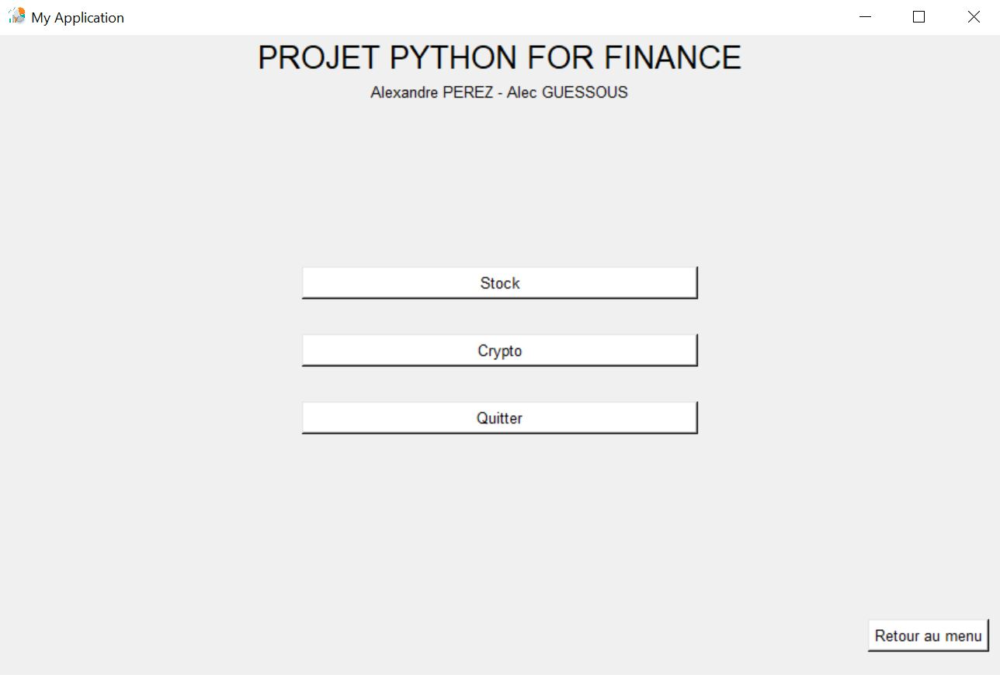

# Python For Finance - Financial Reporting App
## By Alexandre PEREZ and Alec GUESSOUS
***


### General Info
***
<p>
This is a school project as part of a Fintech engineering course.
</p>
<p>
The purpose of the application is to create a reporting of the biggest stock market variations / info news of the financial market and crypto-currency.
The user will also be able to search for variations of a company, a crypto-currency and have access to its graph via a web redirection.
The application allows you to have a quick view on the market variations.
</p>

### Screenshot
<p align = "center">

</p>

## Technologies
***
A list of technologies used within the project:
* [tkinter](https://docs.python.org/fr/3/library/tkinter.html): Version 8.6
* [yahoo_fin](https://pypi.org/project/yahoo-fin/): Version 0.8.6
* [numpy](https://numpy.org/): Version 1.19.4

## Installation
***
```
$ git clone https://github.com/Alexprz03/PythonForFinance
$ cd PythonForFinance
$ pip install tkinter
$ pip install yahoo_fin
$ pip install numpy
```

## Run the project
***
For windows :
```
$ python3 app.py
```

For MacOS :
```
$ python app.py
```
